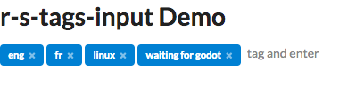

## Objective
collection of react semantic library based non-trivial controls that I needed during my projects development.

## Development 
```
git clone ...
cd ...
npm install 
npm start
```

## Controls 
- tags-input component



- FullSizePage


## To publish
```
nwb build-react-component
npm login
...
...
...
npm publish
```

## Usage
```
npm i react-semantic-ziggurat --save
```

in your app: 
```
import { Layouting } from 'react-semantic-ziggurat'
...
<Layouting.FullSizePage
  footer={<div>Footer</div>}
  header={<div>Header</div>}
  main={<div>main</div>}
  leftAside={<div>leftAside</div>}
  rightAside={<div>reightAside</div>}
/>
```

## Acknowledges
- https://reactjs.org
- https://react.semantic-ui.com/introduction
- https://github.com/insin/nwb
- https://github.com/how-to-react/nwb-jest